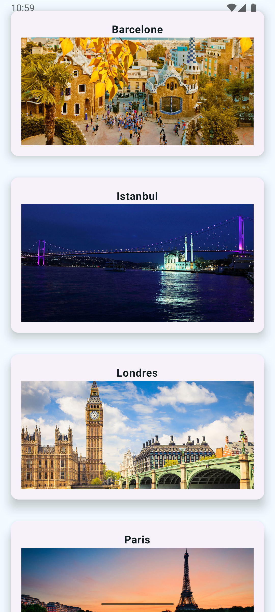
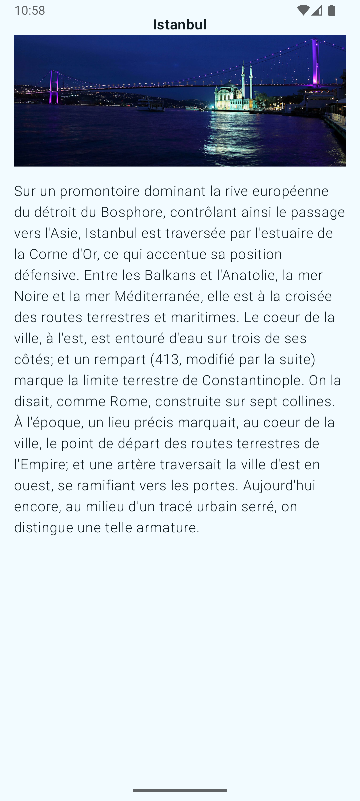

# City Explorer App 🏙️  

  
  
  
  

 

## Features ✨  
- **100% Kotlin 2.0.0** with modern language features  
- **Jetpack Compose** for declarative UI  
- **Coil** for efficient image loading  
- **Retrofit + Flow** for network operations  
- Clean **MVVM** architecture  

## Tech Stack 🛠️  
- **Kotlin 2.0.0**  
- **Jetpack Compose** (UI Toolkit)  
- **Coil Compose** (Image loading)  
- **Retrofit** (Type-safe HTTP client)  
- **Kotlin Flow** (Asynchronous streams)  
